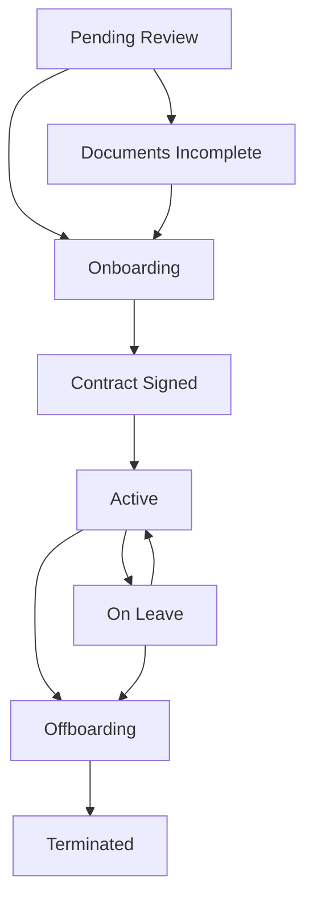

# 员工生命周期 (Employee Lifecycle)

在 Extend Global (EG) 平台中，全职员工 (EOR Employee) 的生命周期是整个人力资源模块的核心骨架。本文档详细定义了员工从被邀请入职到最终离职的各个状态阶段、状态流转的触发条件以及各方角色的操作权限。

## 1. 核心状态机设计

员工在系统中的状态由 `employees` 表的 `status` 字段严格控制。该状态机是一个单向推进的流程，只有在特定条件下允许回退或撤销。

完整的状态枚举及流转路径如下：

## 2. 状态详解与流转条件

### 2.1 Pending Review (待审核)
* **定义**：生命周期的起点。终端客户 (Client) 在门户中发起了新员工的入职邀请，填写了初步的薪资、职位与国家信息。
* **触发者**：Client HR 或 CP 管理员。
* **操作与流转**：
  * EG 的运营团队在 Admin Portal 中收到审核工单。
  * 运营人员检查该国家是否支持 EOR 服务、预估成本是否准确。
  * 审核通过后，系统自动向候选人发送白标入职邀请邮件。
  * 状态流转为 `Documents Incomplete`（如果需要候选人补充材料）或直接进入 `Onboarding`。

### 2.2 Documents Incomplete (资料未齐)
* **定义**：候选人已点击邮件链接登录 Worker Portal，但尚未完成所有必填项或未上传必要的合规附件（如护照扫描件、银行流水）。
* **触发者**：系统自动判断。
* **操作与流转**：
  * 候选人在 Worker Portal 中逐步完成 "Self-Onboarding" 表单。
  * 提交所有必填项后，状态流转为 `Onboarding`。

### 2.3 Onboarding (入职办理中)
* **定义**：候选人资料已齐全，EG 运营团队正在进行线下的合规检查、背景调查，并准备当地的劳动合同。
* **触发者**：候选人提交完整资料。
* **操作与流转**：
  * EG 运营通过系统生成标准的当地劳动合同（PDF）。
  * 将合同发送给候选人与 EG 实体代表进行电子签名（E-Sign）。
  * 双方签署完毕后，状态流转为 `Contract Signed`。

### 2.4 Contract Signed (合同已签署)
* **定义**：法律程序已完成，等待员工的正式入职日（`startDate`）到来。
* **触发者**：合同双签完成。
* **操作与流转**：
  * 系统每日运行的 Cron Job 会检查所有处于此状态的员工。
  * 当系统日期 `>= startDate` 时，Cron Job 自动将状态流转为 `Active`。

### 2.5 Active (在职)
* **定义**：员工正式在职，开始提供劳动并产生计费。
* **触发者**：Cron Job 自动触发，或 Admin 手动强制激活。
* **系统行为**：
  * 员工被纳入每月的薪酬计算（Payroll Run）范围。
  * 员工可以在 Worker Portal 中申请请假（Leave）与报销（Reimbursement）。
  * 客户可以开始为该员工支付每月的 Layer 2 发票。

### 2.6 On Leave (长期休假)
* **定义**：员工处于长期的法定休假状态（如产假、长期病假、无薪假）。
* **触发者**：Client HR 或 Admin 根据员工的请假申请手动调整。
* **系统行为**：
  * 根据当地国家的法定政策，决定休假期间的薪酬发放比例（全薪、半薪或无薪）。
  * 员工仍被保留在系统中，但可能免除或减少每月的服务费（取决于 CP 定价配置）。
  * 休假结束后，状态流转回 `Active`。

### 2.7 Offboarding (离职办理中)
* **定义**：发起了离职流程，正在进行工作交接与最终薪酬结算。
* **触发者**：Client 提出解雇，或员工提出辞职。
* **操作与流转**：
  * 系统计算最后一期的薪酬（Final Pay），包括按比例折算的当月基本工资、未休年假折现（PTO Payout）以及可能的遣散费（Severance Pay）。
  * 所有的报销单必须在此阶段前审批完毕。
  * 最后一期账单（Layer 1 & Layer 2）结清，且保证金（Deposit）完成抵扣或退还后，状态流转为 `Terminated`。

### 2.8 Terminated (已离职)
* **定义**：生命周期的终点。员工已彻底离开公司，所有财务与法律义务已结清。
* **触发者**：离职流程全部完成。
* **系统行为**：
  * 员工不再出现在任何薪酬计算列表中。
  * 员工对 Worker Portal 的访问权限可能被限制（通常保留一段时间供其下载历史工资单和年度税务表格）。

## 3. 跨实体数据关联

在员工生命周期的演进中，其数据记录与系统中的其他实体保持着紧密的关联：

1. **客户归属 (`customerId`)**：员工的归属客户是不可变的。如果员工在不同客户之间转移，必须先 `Terminated`，再作为新员工重新 `Onboarding`。
2. **定价绑定 (`pricingRuleId`)**：员工在 `Active` 状态期间，其产生的费用严格遵循当前生效的 CP/客户定价规则。
3. **休假额度 (`leaveBalances`)**：当状态变为 `Active` 时，系统会根据国家指南（Country Guide）自动为其初始化当年的法定年假额度。

理解员工生命周期的状态机，是排查诸如“为什么某员工没有出现在本月账单中”或“为什么无法审批请假”等常见业务问题的关键。
